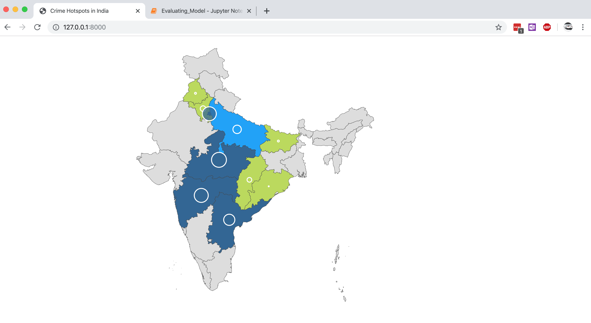

# Mapping crime hotspots onto the map of India

## Running the Django server

```zsh
python3 src/manage.py runserver
```

## Dumping data from the crawler

```zsh
cd src
python3 manage.py shell < dumpdata.py
```

## Output



## Project Structure
```bash
.
├── README.md
├── requirements.txt # python project requirements
└── src
    ├── categories.csv # all the class labels used in the classifier
    ├── classifier # the multi-class text classifier
    │   ├── Evaluation # evaluating the classifier
    │   ├── README.md # read this to understand the classifier
    │   ├── checkpoints_1614428660 
    │   ├── data
    │   │   ├── crawler-output.csv # place the output file after running the crawler here
    │   │   └── train.csv.zip
    │   ├── data_helper.py
    │   ├── predict.py # run this to predict results on your own csv
    │   ├── predicted_results
    │   │   └── predictions_all.csv # result after running predict.py
    │   ├── text_cnn_rnn.py
    │   ├── tf_logging.py
    │   ├── train.py # run this for training the classifier
    │   ├── trained_results_1614428660
    │   └── training_config.json
    ├── crawler
    │   ├── crawler-output.csv
    │   └── news_crawler.py # run this to crawl indiatoday
    ├── crimes # django project
    │   ├── __init__.py
    │   ├── settings.py
    │   ├── urls.py
    │   └── wsgi.py
    ├── db.sqlite3
    ├── dumpdata.py # used to dump data into the django database
    ├── manage.py
    ├── map # the django application
    │   ├── __init__.py
    │   ├── admin.py
    │   ├── apps.py
    │   ├── migrations
    │   ├── models.py
    │   ├── tests.py
    │   └── views.py
    └── templates
        ├── india.html
        └── reference.html
```